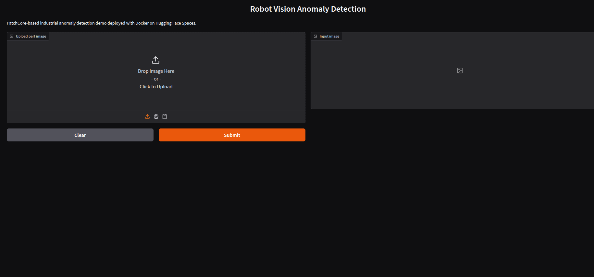
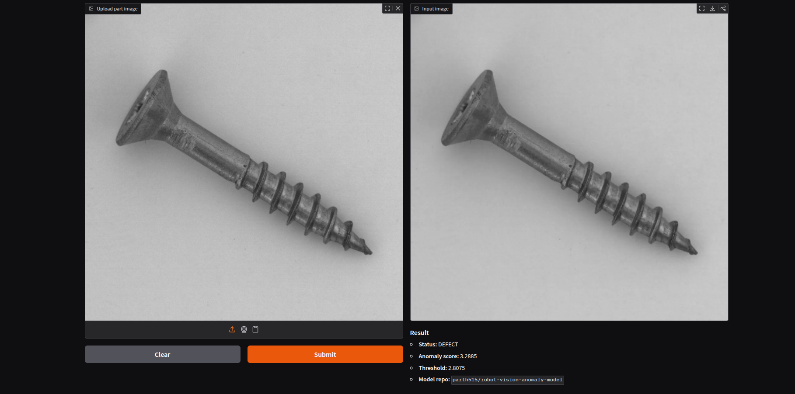

# Robot Vision Feedback Loop - Industrial Anomaly Detection

Unsupervised anomaly detection system for industrial inspection using **PatchCore + ResNet50**.

Learns **normal patterns only** and detects defects as deviations, making it suitable for real-world factory environments with unknown or rare failures.

---

## Live Demo

<p>
  
  
</p>

**[Try the live demo on Hugging Face Spaces](https://huggingface.co/spaces/parth515/robot-vision-anomaly-demo)**

Upload an image of an industrial part and receive:
- Anomaly score
- Decision threshold
- **NORMAL** or **DEFECT** verdict

---

## MLOps Deployment

This project includes a full CI/CD pipeline for automated testing, packaging, and deployment to Hugging Face.

### Architecture

```text
You push to GitHub
        ↓
GitHub Actions mirrors to GitLab
        ↓
GitLab CI/CD (lint → test → docker → deploy)
        ↓                          ↓
HF Model Hub               HF Space (Docker)
(checkpoint + config)      (live Gradio demo)
```

### Pipeline Stages

| Stage | Job | What it does |
|---|---|---|
| `lint` | ruff check | Catches style and unused import errors |
| `test` | pytest | Runs config, threshold, and inference tests |
| `docker` | docker build | Validates image builds and files are present |
| `deploy` | upload_space.py | Pushes Dockerized app to Hugging Face Space |

---

## Features
- No defect labels required — trained on normal images only
- Detects unseen and unknown anomalies at inference
- PatchCore memory bank inference with ResNet50 backbone
- GPU support (CUDA, FP16)
- ONNX / TensorRT export for edge deployment
- Continuous feedback loop — edge cases collected for future retraining
- Dockerized Gradio demo deployed on Hugging Face Spaces
- Full GitLab CI/CD pipeline with lint, test, and deploy stages

---

## How It Works
```text
Train on normal images
        ↓
Build memory bank (PatchCore)
        ↓
Score new samples at inference
        ↓
Flag anomalies above threshold
        ↓
Collect edge cases
        ↓
Retrain on updated data
```

---

## Quick Start
```bash
pip install torch torchvision --index-url https://download.pytorch.org/whl/cu121
pip install -r requirements.txt
bash scripts/full_pipeline.sh screw data/raw/screw/test
```

## Documentation
- [Setup & Installation](docs/setup.md)
- [Running Cycle & Usage](docs/usage.md)
- [Architecture](docs/architecture.md)
- [Deployment & Export](docs/deployment.md)

## Tech Stack

| Component | Technology |
|---|---|
| Anomaly detection | PatchCore |
| Backbone | ResNet50 (torchvision) |
| Deep learning | PyTorch + CUDA (FP16) |
| Dataset | MVTec AD |
| Export | ONNX / TensorRT |
| Demo UI | Gradio |
| Containerization | Docker |
| CI/CD | GitLab CI/CD |
| Model hosting | Hugging Face Model Hub |
| Demo hosting | Hugging Face Spaces |
| Code mirror | GitHub → GitLab via GitHub Actions |
| Testing | pytest + ruff |

### Core Idea

The system learns what normal looks like and flags anything that deviates as anomalous.

## Use Cases
- Industrial visual inspection on factory lines
- Surface defect detection (scratches, dents, contamination)
- PCB quality control
- Metal part anomaly detection
- Any domain with abundant normal samples and rare/unknown defects

## Model

The trained checkpoint is hosted on Hugging Face Model Hub:
**[parth515/robot-vision-anomaly-model](https://huggingface.co/parth515/robot-vision-anomaly-model)**

Files:
- `screw_patchcore.pt` — trained PatchCore memory bank
- `config.yaml` — runtime configuration

### Summary

A practical anomaly detection pipeline designed for industrial environments with unknown and evolving defects.
